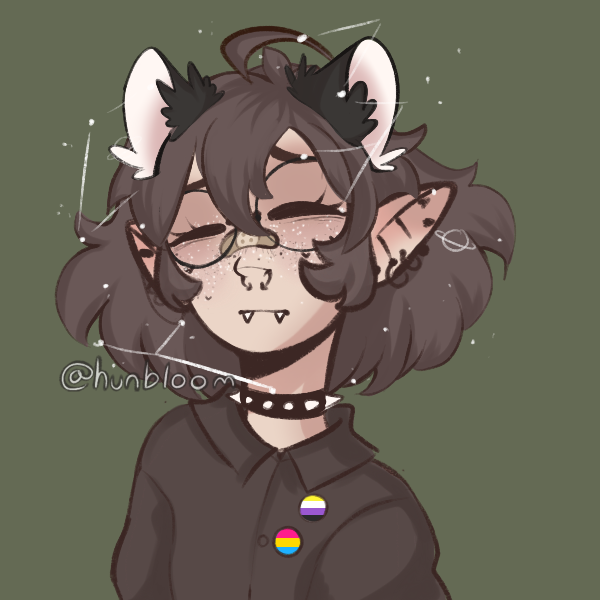

# UnicornyRainbow

**Hi**, I'm UnicornyRainbow or just Unicorn in short.

Some facts about me:

* I use [they/them](https://lgbtqia.fandom.com/wiki/Non-binary/) pronouns.
* I started [programming](https://github.com/UnicornyRainbow/) in the summer of '21 (so I'm pretty much a beginner).
* I'm learning [Python](https://www.python.org/), [Gtk](https://www.gtk.org/) and [Flatpak](https://www.flatpak.org/).
* I use [Fedora](https://getfedora.org/) with the [Gnome](https://www.gnome.org/) desktop.
* I really like [Open Source](https://www.redhat.com/en/topics/open-source/what-is-open-source/) projects and [gaming](https://steamcommunity.com/profiles/76561198362723192).

If you are interested in my projects, you can find an overview [here](https://unicornyrainbow.github.io/UnicornyRainbow/myProjects), visit my [Github](https://github.com/UnicornyRainbow/) or [Gitlab](https://gitlab.com/UnicornyRainbow).
If you want to chat, feel free to contact me via [mail](mailto:unicorn@fastmail.org) or leave me a message on [Discord](https://discord.com/users/539502144450199594) or [Steam](https://steamcommunity.com/profiles/76561198362723192).

---

My profile picture is made with the [character maker](https://picrew.me/image_maker/626197/) from hunbloom on [Picrew](https://picrew.me/search/creator?crid=953491). Also check their amzing art on [Instagram](https://www.instagram.com/hunbloom/?utm_medium=copy_link) and [Twitter](https://twitter.com/hunblooms) out.
